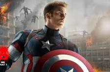

# Captain America
A responsive single-page Avengers-themed portfolio website based on **Captain America** using HTML, CSS, and JavaScript.

## 🚀 Features

- Responsive design for laptop and mobile
- Captain America themed UI
- Full-screen background image
- Fixed navigation bar
- Light / Dark mode toggle
- About section
- Skills & Powers section
- Missions section
- Avengers Team Members section
- Contact section
- Smooth animations and hover effects
- Font Awesome icons

---

## 🧰 Technologies Used

- HTML5
- CSS3
- JavaScript
- Font Awesome

---

## 📂 Sections Included

### 🏠 Home
Hero section with Captain America background and title.

### 📖 About
Information about Steve Rogers and his superhero journey.

### 💪 Skills & Powers
Displays Captain America's abilities and leadership qualities.

### 🌍 Major Missions
Highlights important missions and battles fought by Captain America.

### 👥 Avengers Team
Shows famous Avengers teammates like Iron Man, Thor, Hulk, Black Widow, Hawkeye, Spider-Man, Falcon, Scarlet Witch, Vision, and Black Panther.

### 📞 Contact
Contains fictional Avengers contact information.

---

## 🌗 Light / Dark Mode

A JavaScript toggle button changes:
- Background colors
- Text colors
- Card styles
---


## 📸 Preview
### Main Interface
Captain America themed modern portfolio website inspired by Marvel Avengers.


---

## 📂 Project Structure

```bash
📁 Captain-America-Portfolio/
    │
    ├── index.html
    │
    ├── style.css
    │
    ├── README.md
    │
    └── assets/
        │
        └── captain-america.jpg
## 👨‍💻 Created By

Meghana Palavalasa

---

## 🛡 Avengers Assemble!